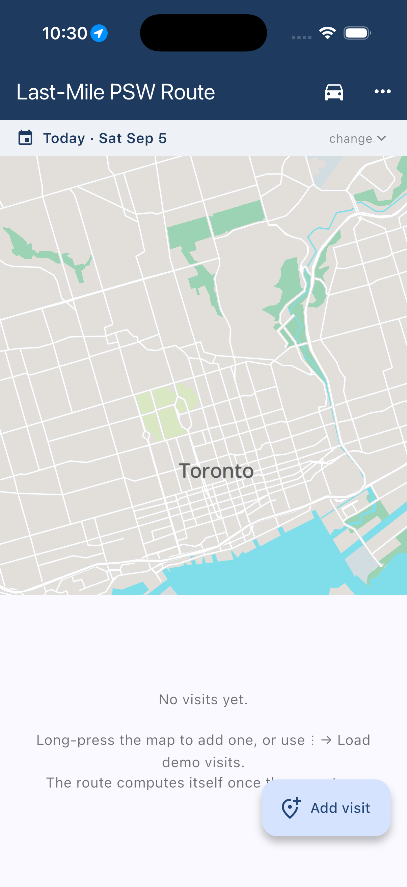

# Last-Mile PSW

A care-day planning prototype for personal support workers managing their assigned visits.

Plan visits around care duration, arrival windows, priorities, shift hours, and breaks. Re-plan when the day changes and review waiting time, lateness, and overtime.

The iOS prototype includes local address search, offline maps and routing within bundled coverage, and in-app navigation with voice guidance. Schedules use platform encrypted credential storage.

The app is under development. Offline routing requires the appropriate regional assets. Live Activity integration and Android native routing are unfinished. Travel-time estimates and map rendering have known limitations; this is not a clinically validated product.

Real app screenshots and a demonstration video are being prepared using fictional visits.

This screenshot is from the running iOS simulator build and shows the bundled
offline map. Visit-order, conflict, and turn-by-turn screenshots will be added
after the demo flow is driven on a device.

Contact: [AubinGil on GitHub](https://github.com/AubinGil).
